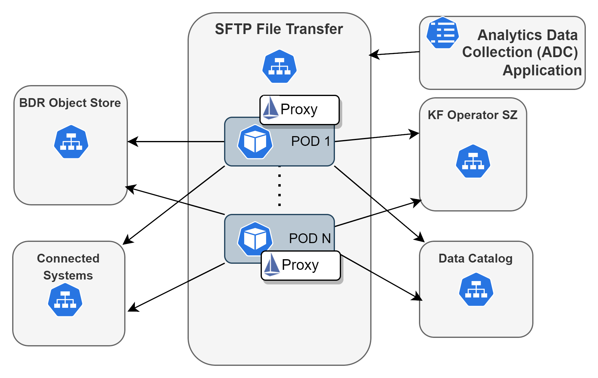

<!--Document Template information:
Prepared:Stefano Volpe
Approved:***
Document Name:user-guide-template
Revision: {!.bob/var.user-guide-version!}
Date: {!.bob/var.date!}
-->

# SFTP File Transfer User Guide

## Table Of Contents
1. [Overview](#Overview)
2. [Supported Use Cases](#Supported Use Cases)
3. [Architecture](#Architecture)
4. [Deployment View](#Deployment View)
   1. [Dimensioning and Characteristics](#Dimensioning and Characteristics)
      1. [Dimensioning](#Dimensioning)
      2. [Scaling](#Scaling)
      3. [Resilience](#Resilience)
      4. [Upgrade In Service Software Upgrade](#Upgrade In Service Software Upgrade)
5. [Deployment](#Deployment)
   1. [Prerequisites](#Prerequisites)
   2. [Custom Resource Definition CRD Deployment](#Custom Resource Definition CRD Deployment)
   3. [Deployment in a Kubernetes Environment using Helm](#Deployment in a Kubernetes Environment using Helm)
      1. [Preparation](#Preparation)
      2. [Pre-Deployment Checks for SFTP File Transfer Service](#Pre-Deployment Checks for SFTP File Transfer Service)
      3. [Helm Chart Installations of Dependent Services](#Helm Chart Installations of Dependent Services)
      4. [Helm Chart Installation of SFTP File Transfer Service](#Helm Chart Installation of SFTP File Transfer Service)
      5. [Deploy the SFTP File Transfer Service](#Deploy the SFTP File Transfer Service)
      6. [Verify the SFTP File Transfer Service Availability](#Verify the SFTP File Transfer Service Availability)
6. [Configuration Parameters](#Configuration Parameters)
   1. [Optional Configuration Parameters](#Optional Configuration Parameters)
7. [Service Dimensioning](#Service Dimensioning)
   1. [Override Default Dimensioning Configuration](#Override Default Dimensioning Configuration)
   2. [Use Minimum Configuration per Service Instance](#Use Minimum Configuration per Service Instance)
   3. [Use Maximum Default Configuration per Service Instance](#Use Maximum Default Configuration per Service Instance)
8. [Hardening](#Hardening)
   1. [Hardening during product development](#Hardening during product development)
   2. [Hardening during service delivery](#Hardening during service delivery)
   3. [Automated procedures and hardening scripts](#Automated procedures and hardening scripts)
   4. [References](#References)
9. [Upgrade Procedures](#Upgrade Procedures)
10. [Security Guidelines](#Security Guidelines)
    1. [Operative Tasks](#Operative Tasks)
    2. [Certificates](#Certificates)
    3. [Security Events That Can Be Logged](#Security Events That Can Be Logged)
11. [Privacy User Guidelines](#Privacy User Guidelines)
12. [Operation and Maintenance](#Operation and Maintenance)
    1. [Performance Management](#Performance Management)
       1. [Default Metrics](#Default Metrics)
       2. [KPIs](#KPIs)
    2. [Backup and Restore](#Backup and Restore)
    3. [Scaling](#Scaling)
13. [Troubleshooting](#Troubleshooting)
    1. [Prerequisites](#Prerequisites)
    2. [Installation](#Installation)
    3. [Deletion of Release](#Deletion of Release)
    4. [Health Checks](#Health Checks)
    5. [Enable Debug Logging](#Enable Debug Logging)
    6. [Log Categories](#Log Categories)
    7. [Data Collection](#Data Collection)
    8. [Bug Reporting and Additional Support](#Bug Reporting and Additional Support)
       1. [Additional Support](#Additional Support)
       2. [Bug Reporting](#Bug Reporting)
    9. [Recovery Procedure](#Recovery Procedure)
       1. [Restarting the Pod](#Restarting the Pod)
       2. [Data Recovery](#Data Recovery)
14. [Known Issues](#Known Issues)
15. [References](#References)


## Overview
SFTP File Transfer Service is part of the Automation Platform of IDUN. SFTP File Transfer Service enables the SFTP transfer of PM Counter Files from an ENM system and storage of PM Counter files in Bulk Data Repository.
The SFTP File Transfer Service receives PM Counter File available notifications from Kafka which are produced by ENM File Notification Service. The location of the PM Counter Files on the ENM system is included in the notification.
The SFTP File Transfer Service consumes the messages, and transfers the PM Counter files over SFTP from the ENM system, stores them in Bulk Data Repository and produces PM Counter Files notifications available in Bulk Data Repository on an output Kafka topic for other services to consume.

## Supported Use Cases
Following are the use cases supported by SFTP File Transfer:

| Use Case ID | Use Case Title                                                                                             | Compliance      |
|-------------|------------------------------------------------------------------------------------------------------------|-----------------|
| 1           | SFTP Transfer of LTE and NR PM Counter Files (Compressed/Uncompressed) and Storage in Bulk Data Repository | Fully Supported |


## Architecture

The following picture shows the SFTP File Transfer Service and its
architectural context.


Figure 1 Architecture view of SFTP File Transfer Service

#### Logical Interfaces


| Interface Logical Name              | Interface Realization                 | Description                                                                                                                                                                                                                                                                            | Interface Maturity |
|-------------------------------------|---------------------------------------|----------------------------------------------------------------------------------------------------------------------------------------------------------------------------------------------------------------------------------------------------------------------------------------|--------------------|
| ENM File Notification Service Topic | [KF Operator SZ microservice][mbkf]   | The KF Operator SZ Input topic is owned and created by the ENM File Notification Service. It is used to alert the service that there are new PM Counter Files available.                                                                                                               | Stable             |
| SFTP File Transfer Service Topic    | [KF Operator SZ microservice][mbkf]   | The KF Operator SZ Output Topic is owned and created by SFTP File transfer Service, and it is registered in Data Catalog. The service publishes the location of the files stored in Object Store MN to the KF Operator SZ Output Topic so that they may be consumed by other services. | Stable             |
| Connected Systems                   | [Connected Systems][cs]               | This service provides SFTP Credentials for the Ericsson Network Manager Scripting VMs via REST                                                                                                                                                                                         | Stable             |
| ENM File Notification Service       | [ENM File Notification Service][efns] | PM Counter files are downloaded from Ericsson Network Manager's file system using it's Scripting VM interface (behaving as an SFTP server).                                                                                                                                            | Beta               |
| Data Catalog                        | [Data Catalog][dc]                    | Data Catalog stores prerequisite information on the datatype(e.g RAN) that the service is interested in. Data Catalog also provides the name of Connected Systems to the service via REST.                                                                                             | Stable             |
| Object Store MN                     | [Object-Storage-MN][osmn]             | This service stores the PM Counter Files in Object Store MN.                                                                                                                                                                                                                           | Stable             |
| Performance Management Server       | [Performance Management Server][pms]  | Performance Management Server is used for metrics.                                                                                                                                                                                                                                     | Beta               |


## Deployment View

SFTP File Transfer Service is packaged as a Docker container. It supports deployment in Kubernetes using Helm.

The SFTP File Transfer jar is stored in one container in a pod. It supports one or more pod replicas (instances of the service).  When Service Mesh is enabled, a proxy sidecar is deployed within a pod and REST end points will use HTTPS.

On startup of the service, the service completes a health check of all dependent services i.e. Object Store MN, Message Bus KF, Data Catalog and Connected Systems to ensure a valid connection to the Ericsson Network Manager Scripting VM before starting the kafka listener.

The service creates the Output Topic on the KF Operator SZ. This is the same instance of KF Operator SZ that the service queried for the Input Topic. Both topics must exist on the same instance to facilitate transactions.

The data service, data service instance, consumed parameters, data types with schema name and schema version, Output Topic, Data Provider Type and File Format, are registered in Data Catalog for consumers to retrieve.
The service creates the Object Store MN Bucket used to store the PM Counter files using the data service name and datatype configured in value.yaml.

The service listens to an Input Topic that is produced by the ENM File Notification Service. The Input Topic message contains the path to the file to be retrieved from the Ericsson Network Manager Scripting VM.
The **InputTopicListener** receives these messages, processes them and initiates the downloading of PM Counter files using the **SFTPFileTransferService** from the Ericsson Network Manager Scripting VM.

Each of these files are then uploaded to Object Store MN and a new message is produced and sent to the Output Topic containing the location of the file in the Object Store MN.

The files are automatically removed at the expiry of 1 hour. This is handled by a scheduled job which runs every 15 minutes and removes files older than an hour.
The frequency of the run and the duration for which a file is persisted are configurable.
However, care must be taken that the cumulative size of the files doesn't exceed the capacity of Object Store MN or quota of bucket.
The default value of 15 mins frequency and 1 hour of file persistence has been chosen based on total capacity of 90GB available for Object Store MN and 40k PM counter files of size 180kb each.


Each data service instance is removed from the Data Catalog on the un-deployment of the SFTP File Transfer Service.
If it is the last SFTP File Transfer service instance, the data service instance, file format and data provider type will be automatically removed from the Data Catalog.



Figure 2 Deployment view of SFTP File Transfer Service

To deploy the Service, refer to the [Deployment section](#deployment), which:

- explains how to get started using the SFTP File Transfer Service in the
supported environments.
- specifies configuration options for starting the SFTP File Transfer docker
container.

If problems occur when using the service, refer to the [Troubleshooting section](#troubleshooting).

### Dimensioning and Characteristics

#### Dimensioning

The service provides by default resource request values and resource limit values as part of the Helm chart.
Each pod connects to one scripting VM and uses one SFTP connection.

To handle dimensioning configuration at deployment time, refer to the Deployment section.

#### Scaling

The service supports manual scaling which can be set using the replicaCount parameter in values.yaml.

>**_Note:_** Manual scaling is a time-consuming process and should not be done frequently.

If manual scaling is performed through Helm during the middle of a ROP the Consumer will be rebalanced, work redistributed among all available pods/listeners.
Scaling performance is bound by the maximum number of SFTP connections supported by the Ericsson Network Manager Scripting VMs and how many Scripting VMs are available.
The scaling performance is also dependent on the number of Input Topic partitions set by the ENM File Notification Service.


| Scaling Supported (Yes/No) | Minimum number of instances | Maximum number of recommended instances |
|----------------------------|-----------------------------|-----------------------------------------|
| Yes (Manual)               | 1                           | 3                                       |

#### Resilience

* Transactions are used to implemented exactly-once semantics to ensure no data is duplicated.

* SFTP File Transfer Service uses Liveness and Readiness probes provided by Kubernetes.

* By default, the SFTP File Transfer Service has a replica count of 2. This can be increased in the values.yaml or at deployment time using --set arguments to provided higher availability.

* For file downloading retries will be made on failure determined by optional parameter 'file_download_retries' (configured in values.yaml, default value 3) times. For Object Store MN upload we will attempt to upload number_of_connection_attempts (configured in values.yaml, default value 3).

* When the SFTP File Transfer Service pod is deployed when there are no external dependencies available the pod waits gracefully for dependent services to be ready. As dependent services become available the service proceeds to normal operation. The diagram below shows the flow of these external dependency checks.


#### Upgrade In Service Software Upgrade

SFTP File Transfer service supports upgrade without loss of notifications. If a SFTP File Transfer pod is upgraded while processing files the number of files processed by the upgraded pod is as expected from a pod in normal operation.
This is achieved through Kubernetes' rolling update strategy, see [Kubernetes Rolling Updates][kru]. Rolling updates incrementally replace your resource's Pods with new ones, which are then scheduled on nodes with available resources. Rolling updates are designed to update your workloads without downtime.
Retaining data with persistent volumes is not an issue for SFTP File Transfer service as the service is stateless.

>**_Note:_** If non default values have been set using the --set arguments at deployment they must be set again when performing an upgrade.

## Deployment
This section describes the operational procedures for how to deploy and upgrade the SFTP File Transfer Service in a Kubernetes environment with Helm.

### Prerequisites
The following describes the areas of prerequisites for the system:

- A running Kubernetes environment with Helm support, some knowledge
   of the Kubernetes environment, including the networking detail, and
   access rights to deploy and manage workloads.

- Availability of the kubectl CLI tool with correct authentication
    details. Contact the Kubernetes System Admin if necessary.

- Availability of the Helm package.

- Availability of Helm charts and Docker images for the service and
    all dependent services
  - DMM KF Operator SZ
  - DMM Data-Catalog
  - Object Storage MN service
  - ENM File Notification Service
  - Connected Systems
  - Proxy Sidecar when mTLS support is required
- Docker registry to host docker images.
- Docker registry must be accessible from client and the nodes inside the cluster.


### Custom Resource Definition CRD Deployment
No Custom Resource Definitions are used with the SFTP File Transfer service.

### Deployment in a Kubernetes Environment Using Helm

This section describes how to deploy the service in Kubernetes using Helm and
the `kubectl` CLI client. Helm is a package manager for Kubernetes that
streamlines the installation and management of Kubernetes applications.

#### Preparation

Prepare helm chart and Docker images. Helm chart in the following link
can be used for installation:

https://arm.seli.gic.ericsson.se/artifactory/proj-eric-oss-drop-helm-local/eric-oss-sftp-filetrans/

#### Pre-Deployment Checks for SFTP File Transfer Service

Ensure the following:

- The <RELEASE_NAME> is not used already in the corresponding cluster.
Use `helm list` command to list the existing deployments (and delete previous
deployment with the corresponding <RELEASE_NAME> if needed).

- The same namespace is used for all deployments.

#### Helm Chart Installations of Dependent Services

This service requires Data Management and Movement, ENM File Notification Service, Connected Systems and Object Store MN to be installed on the same namespace prior to deploying the service.

- Data Management and Movement installation:

  Refer to Data Management and Movement documentation at [Data Management and Movement][dmm].

- ENM File Notification Service:

  Refer to ENM File Notification Service documentation at [ENM File Notification Service][efns].
- Connected Systems:

  Refer to Connected System documentation at [Connected Systems][cs].

- Object Store MN:

  Refer to Object Store MN documentation at [Object Store MN][osmn].

#### Helm Chart Installation of SFTP File Transfer Service
>**Note:** Ensure all dependent services are deployed and healthy before you continue with this step (see previous chapter).

Helm is a tool that streamlines installing and managing Kubernetes applications. SFTP File Transfer can be deployed on Kubernetes using Helm Charts. Charts are packages of pre-configured Kubernetes resources.

Users can override the default values provided in the values.yaml template of  the helm chart. The recommended parameters to override are listed in the following section: [Configuration Parameters](#configuration-parameters).

#### Deploy the SFTP File Transfer Service

Install the SFTP File Transfer application on the Kubernetes cluster by using the helm installation command:
```text
helm install <CHART_REFERENCE> --name <RELEASE_NAME> --namespace <NAMESPACE> --set spring.kafka.topics.enm_id=<SUBSYSTEM_NAME> --set subsystem.name=<SUBSYSTEM_NAME>
```
The variables specified in the command are as follows:

- <CHART_REFERENCE>: A path to a packaged chart, a path to an unpacked chart directory or a URL.
- <RELEASE_NAME>: String value, a name to identify and manage your helm chart.
- <NAMESPACE>: String value, a name to be used dedicated by the user for deploying own Helm charts.
- spring.kafka.topics.enm_id: String value, name of the subsystem/enm that service is processing data for, used as the suffix for the input and output topic of the service.
- subsystem.name: String value, the name of the subsystem configured in Connected Systems .

#### Verify the SFTP File Transfer Service Availability

To verify whether the deployment is successful, do as follows:

1. Check if the chart is installed with the provided release name and in related namespace by using the following command:
```text
$helm ls --namespace=<SERVICE_NAMESPACE>
```
Chart status should be reported as "DEPLOYED".

2. Verify the status of the deployed helm chart.
```text
$helm status <RELEASE_NAME> --namespace=<SERVICE_NAMESPACE>
```
Chart status should be reported as "DEPLOYED". All Pods status should be reported as "Running" and number of Deployment Available should be the same as the replica count.

3. Verify that the pods are running by getting the status for your pods.
```text
$kubectl get pods --namespace=<SERVICE_NAMESPACE> -L role
```

All pods status should be "Running". All containers in any pod should be reported as "Ready".

## Configuration Parameters

#### Mandatory Configuration Parameters
The parameters in following table are mandatory to set at deployment time. If not provided, the deployment will fail. There are no default values provided for this type of parameters.

| Variable Name                                                              | Description                                                        |
|----------------------------------------------------------------------------|--------------------------------------------------------------------|
| dmm.data_catalog.data_service.data_service_instance.consumed_data_provider | Consumed Data Provider of the Data Service Instance                |
| dmm.data_catalog.data_service.datatype.schema_name                         | The schema name of the datatype on Data Service                    |
| spring.kafka.topics.input.name                                             | Name of the Input Topic                                            |
| subsystem.name                                                             | Name of the ENM configured in connected System (Subsystem Manager) |

### Optional Configuration Parameters

Following parameters are not mandatory. If not explicitly set
(using the --set argument), the default values provided
in the helm chart are used.

| Variable Name                               | Description                                                                                                                                                                            | Default Value                            |
|---------------------------------------------|----------------------------------------------------------------------------------------------------------------------------------------------------------------------------------------|------------------------------------------|
| spring.kafka.transaction.max_retry_attempts | Value to determine how many times kafka should retry a failed transaction. Setting it to -1 means kafka wont reattempt and prevents rollbacks                                          | -1                                       |
| spring.kafka.bootstrap_servers              | Endpoint of the bootstrap server.                                                                                                                                                      | http://eric-oss-dmm-kafka-bootstrap:9092 |
| appArmorProfile.type                        | Configuration of AppArmor profile type.                                                                                                                                                | ""                                       |
| seccompProfile.type                         | Configuration of Seccomp profile type.                                                                                                                                                 | "RuntimeDefault"                         |
| securityPolicy.rolename                     | Name of the associated Role or ClusterRole in the SecurityPolicy.                                                                                                                      | "eric-oss-sftp-filetrans"                |
| affinity.topologyKey                        | Pod anti-affinity topology key defines which topology domain to consider when evaluating the anti-affinity rule. Examples are the node's region, zone or hostname, among others.       | "kubernetes.io/hostname"                 |
| podSecurityContext.supplementalGroups       | Sets the GID value(s) for volume data that is used by the services.                                                                                                                    | null                                     |
| bdr.fileDeleteRate                          | The frequency at which the scheduled task run for cleaning up of BDR files                                                                                                             |                                          |
| bdr.filePersistenceDuration                 | The duration a file is persisted on BDR                                                                                                                                                |                                          |

## Service Dimensioning

The service provides by default resource request values and resource limit
values as part of the Helm chart. These values correspond to a default size for
deployment of an instance. This chapter gives guidance on how to do service
dimensioning and how to change the default values when needed.

### Override Default Dimensioning Configuration

If other values than the default resource request and default resource limit
values are preferred, they must be overridden at deployment time.

Here is an example of the `helm install` command where resource requests and
resource limits are set:

```text
helm install eric-oss-sftp-filtrans https://arm.seli.gic.ericsson.se/artifactory/proj-eric-oss-drop-helm/eric-oss-sftp-filetrans/<LATEST_RELEASE> --set resources.eric-oss-sftp-filetrans.limits.cpu=100m --set resources.eric-oss-sftp-filetrans.limits.memory=384Mi
```

### Use Minimum Configuration per Service Instance

This chapter specifies the minimum recommended configuration per service
instance.

| Resource Type (Kubernetes Service) | Resource Request Memory | Resource Limit Memory | Resource Request CPU | Resource Limit CPU | Resource Request Ephemeral-storage | Resource Limit Ephemeral-storage |
|------------------------------------|-------------------------|-----------------------|----------------------|--------------------| -----------------------------------|----------------------------------|
| SFTP File Transfer                 | 256Mi                   | 2Gi                   | 500m                 | 1000m              |            64Mi                    |                  1G              |

To use minimum configuration, override the default values for resource requests
and resource limits in the helm chart at deployment time.

### Use Maximum Default Configuration per Service Instance

The maximum recommended configuration per instance is provided as default in the
Helm chart. Both Resource Request values and Resource Limit values are included
in the helm charts.

## Hardening

### Hardening during product development

* The service is built on a minimalistic container image with small footprints. Only the required libraries are included.
* The service utilizes a container optimized operating system (Common Base OS) and latest security patches are applied.
* The containers go through vulnerability scanning.
* The service is configured to the strict minimum of services and ports to minimize the attack surface.
* Seccomp is enabled by default with the profile "RuntimeDefault" set in values.yaml (Please see [Configuration Parameters](#configuration-parameters) for further details).
* The service can operate in service mesh for mTLS HTTPS support.

### Hardening during service delivery

* Seccomp is enabled by default with the profile "RuntimeDefault" set in values.yaml (Please see [Configuration Parameters](#configuration-parameters) for further details). Alternative profiles may be set at deployment by overriding the default value by using the -- set argument.
* Service Mesh can be enabled by setting TLS support at the global chart level.  A sidecar will be added to the service and all HTTP communication will be redirected through the sidecar.

### Egress Gateway Configuration

If Egress Gateway is to be used with Service Mesh it should be configured in the global chart level using the information below:

* use following parameters outlined in the below table
* OSS Common Base must be configured with Egress ports assigned under section service-mesh-egress-gateway.ports

| Variable Name | Description                                                                                                                                                 | Mandatory |
|---------------|-------------------------------------------------------------------------------------------------------------------------------------------------------------|-----------|
| targetAddress | SFTP File Transfer requires the public address of the ENM SFTP Server                                                                                       | Yes       |
| targetPort    | SFTP File Transfer requires the port of the ENM SFTP Server to connect to via TCP                                                                           | Yes       |
| protocol      | TCP in case of client/server SFTP                                                                                                                           | Yes       |
| egressGwPort  | egress-gateway port. Use here the custom service egress-gateway port defined in the service-mesh-egress-gateway.ports section of OSS Common Base platform   | Yes       |
| proxyHost     | External proxy host                                                                                                                                         | No        |
| proxyPort     | External proxy port                                                                                                                                         | No        |

Example of direct communication with target address:

```yaml
...
  egressExternalHosts:
    smegPassThrough:
      properties:
        - targetAddress: example-sftp-server.svc.cluster.local
          targetPort: 9023
          protocol: TCP
          egressGWPort: 7003
```

Example of communication through a proxy:

```yaml
...
  egressExternalHosts:
    smegPassThroughProxy:
      properties:
        - targetAddress: example-sftp-server.svc.cluster.local
          targetPort: 9023
          protocol: TCP
          egressGWPort: 7003
          proxyHost: example-http-proxy.svc.cluster.local
          proxyPort: 3128
```

### Automated procedures and hardening scripts

The SFTP File Transfer service does not include any automated procedures or scripts for hardening.

### References

*See the following documents for more details:<br/>
[Hardening Guideline Instruction](https://erilink.ericsson.se/eridoc/erl/objectId/09004cff8b35654f?docno=LME-16:002235Uen&action=approved&format=msw12)<br/>
[Hardening Guideline Template](https://erilink.ericsson.se/eridoc/erl/objectId/09004cff8b355119?docno=LME-16:002234Uen&action=approved&format=msw12)<br/>
[Recommended Hardening Activities](https://erilink.ericsson.se/eridoc/erl/objectId/09004cffc724ed0d?docno=GFTL-21:000631Uen&action=approved&format=msw12)<br/>
[Kubernetes Security Design Rules](https://confluence.lmera.ericsson.se/pages/viewpage.action?spaceKey=AA&title=Kubernetes+Security+Design+Rules)<br/>

## Upgrade Procedures

>**Note:** If any chart value is customized at upgrade time through the
>"--set" option of the "helm upgrade" command, all other previously customized
>values will be replaced with the ones included in the new version of the chart.
>To make sure that any customized values are carried forward as part of the
>upgrade, consider keeping a versioned list of such values. That list could be
>provided as input to the upgrade command in order to be able to use the "--set"
>option without side effects.

* Ensure that `spring.kafka.topics.enm_id` is kept the same as the previous installation.
* Ensure that `subsystem.name` is kept the same as the previous installation.
* Ensure that `spring.kafka.topics.output.partitions` (the number of Output Topic partitions) is kept the same as the previous installation.

## Security Guidelines

### Operative Tasks

This service does not include any operative tasks.

#### External Ports

None

#### Internal Ports

| Service or Interface name             | Protocol   | IP Address Type   | Port    | Transport Protocol   | IP Version   |
|---------------------------------------| ---------- | ----------------- |---------| -------------------- | ------------ |
| Liveness/Readiness                    | HTTP       | OAM IP            | 33631   | TCP                  | IPv4         |
| Metrics                               | HTTP       | OAM IP            | 33631   | TCP                  | IPv4         |
| KF Operator SZ                        | Binary     | OAM IP            | 9092    | TCP                  | IPv4         |
| Data Catalog                          | HTTP       | OAM IP            | 9590    | TCP                  | IPv4         |
| Connected Systems                     | HTTP       | OAM IP            | Runtime | TCP                  | IPv4         |
| Ericsson Network Manager Scripting VM | SFTP       | OAM IP            | Runtime | TCP                  | IPv4         |

### Certificates

No certificates are used.

### Security Events That Can Be Logged

No security events logged by the service.

## Privacy User Guidelines

The service does not collect, store or process personal data on its own, PTI==0

## Operation and Maintenance

### Performance Management

#### Default Metrics

Following table lists the description for all default metrics.

| Metric                                                                  | Description                                                                                                                               |
|-------------------------------------------------------------------------|-------------------------------------------------------------------------------------------------------------------------------------------|
| eric.oss.sftp.filetrans:num.successful.file.transfer.total              | Describes the number of PM counter files successfully downloaded from the ENM Scripting VMs.                                              |
| eric.oss.sftp.filetrans:num.failed.file.transfer.total                  | Describes the number of PM counter files that failed to download from the ENM Scripting VMs.                                              |
| eric.oss.sftp.filetrans:num.input.kafka.messages.received.total         | Describes the number of PM counter file notifications that have been received from the Strimzi Kafka input topic.                         |
| eric.oss.sftp.filetrans:processed.files.time.total                      | Describes the total time taken in seconds to download PM counter files from the ENM Scripting VMs and upload to the Bulk Data Repository. |
| eric.oss.sftp.filetrans:processed.counter.file.data.volume.total        | Describes the total volume of data in bytes that has been downloaded from ENM Scripting VMs.                                              |
| eric.oss.sftp.filetrans:num.output.kafka.messages.produced.successfully | Describes the number of PM counter files successfully upload from the Bulk Data Repository to Strimzi Kafka output topic.                 |
| eric.oss.sftp.filetrans:processed.bdr.data.volume.total                 | Describes the total volume of data in bytes that has been uploaded to the Bulk Data Repository.                                           |
| eric.oss.sftp.filetrans:num.successful.bdr.uploads.total                | Describes the number of PM counter files successfully upload from the Bulk Data Repository.                                               |
| eric.oss.sftp.filetrans:num.failed.bdr.uploads.total                    | Describes the number of PM counter files that failed upload from the Bulk Data Repository.                                                |

### Backup and Restore

The service does not support any kind of backup and restore operation.

### Scaling

The service supports manual scaling which can be set using the `replicaCount` parameter in values.yaml. `replicaCount` can increase or decrease the number of replicas (pods in the StatefulSet).
Scaling performance is bound by the maximum number of SFTP connections supported by the Ericsson Network Manager Scripting VM and how many Scripting VMs are available. 
The scaling performance is also dependent on the number of Input Topic partitions set by the ENM File Notification Service. (Please see [Dimensioning and Characteristics](#dimensioning-and-characteristics) in section Dimensioning and Characteristics for recommended number of instances).

## Troubleshooting

This section describes the troubleshooting functions and procedures for
the SFTP File Transfer service. It provides the following information:

-   Simple verification and possible recovery.

-   The required information when reporting a bug or writing a support case,
    including all files and system logs that are needed.

-   How to retrieve the above information from the system.

### Prerequisites

-   `kubectl` CLI tool properly configured

### Installation

If Installation fails, refer [Recovery Procedure](#recovery-procedure) to recover and [Data Collection](#data-collection) to collect logs.

### Deletion of Release

If Installation fails, refer [Recovery Procedure](#recovery-procedure) to recover and [Data Collection](#data-collection) to collect logs.

To delete the release the service can be uninstalled by helm uninstall command:
```
  helm uninstall <RELEASE_NAME> --namespace=<SERVICE_NAMESPACE>
```

Pre Delete hooks on uninstall:
```
  charts/eric-oss-sftp-filetrans/templates/hooks/preDeleteJob.yaml
```
Above hook job will be called before uninstall and this will call the API to delete the configured Data Service instance from the Data Catalog.
The response of this job will be stored in a pod eric-oss-sftp-filetrans-pre-delete-job-xxxx

To check if the pre deleted hook is deployed and Data Service Instance is deleted during uninstall process:
```
$ kubectl get pod -n <SERVICE_NAMESPACE>
NAME                                                   READY     STATUS           RESTARTS   AGE
eric-oss-sftp-filetrans-6ffcf47f8c-cpp6k               1/1       Terminating       0         5m47s
phoenix-app-pre-delete-job-5d5fn                       0/1       Completed         0         25s

$ kubectl logs phoenix-app-pre-delete-job-5d5fn -n <SERVICE_NAMESPACE>
```
The uninstall of the service can fail on de-registration of the dataserviceinstance from data catalog.
If the service fails to uninstall, the error is logged.
Use helm parameter --no-hooks to force uninstall of the service if the error is not recoverable.

### Health Checks

Deployment or upgrade failures with CrashLoopBackOff status:

The SFTP File Transfer service has a health check that validates some service configuration parameters. This health check uses the Kubernetes Readiness and Liveness probe. If the parameters are considered invalid, the health check will fail. This will prevent the Diagnostic Data Collector from successfully starting, and the pod will be in status CrashLoopBackOff.

To check if the pod is in status CrashLoopBackOff you can give the following command:

```
$ kubectl get pod --namespace=<SERVICE_NAMESPACE>
NAME                                                   READY     STATUS             RESTARTS  AGE
eric-oss-sftp-filetrans-6ffcf47f8c-cpp6k               0/1       CrashLoopBackOff   1         14s
```

*1.  View the status of SFTP File Transfer Service Helm installation*

```text
$helm list --namespace=<SERVICE_NAMESPACE> | grep -E 'sftp-filetrans'
```

*2.  Check SFTP File Transfer Service Deployment are running*

```text
$kubectl --namespace=<SERVICE_NAMESPACE> get deploy | grep -E 'sftp-filetrans'
```

*3.  Check that the pods are running*

```text
$kubectl --namespace=<SERVICE_NAMESPACE> get pods | grep -E 'sftp-filetrans'
```

*4.  Check SFTP File Transfer Service Logs*

```text
$kubectl logs <POD_NAME> --namespace=<SERVICE_NAMESPACE> | grep -E 'healthy'
```

### Deletion of BDR Files

It can be verified that the scheduled task for cleaning up files is running as expected by using the below command

```text
$kubectl logs <POD_NAME> --namespace=<SERVICE_NAMESPACE> | grep -E 'Count of Files Deleted Successfully:'
$kubectl logs <POD_NAME> --namespace=<SERVICE_NAMESPACE> | grep -E 'Count of Files Errored:'
```
The logs can be used to verify
* The Scheduled Task for Cleanup is running every 15 minutes. In case of multiple pods, even if it runs from a single pod, it should be fine.
* In case the scheduled task is not getting trigerred from any of the pod, a pod restart is required.
* Files which have errored out shall be tried during the subsequent runs.
* However, if the files are erroring out continuosly and storage build up is happening on Object Storage MN, a manual delete shall be required on Object Storage MN
* The following command can be used for deleting directly on Object Storage MN
```text
mc rm --recursive <ALIAS>/<BUCKET NAME> --older-than #d#hh#mm#ss
```


### Enable Debug Logging
Debug logging is enabled for the SFTP File Transfer service.

Change the runtime log configuration of the pod by changing the eric-oss-sftp-filetrans-log-control-configmap 'severity' field to read 'DEBUG' within logcontrol.json. Default value is 'INFO'.

Edit the eric-oss-sftp-filetrans-log-control-configmap with the following command:
```
kubectl edit configmap eric-oss-sftp-filetrans-log-control-configmap --namespace=<SERVICE_NAMESPACE>
 ```


### Log Categories

The SFTP File Transfer service does not use any log categories.

### Data Collection

- The logs are collected from each pod using command:

```text
kubectl logs <pod name> --namespace=<SERVICE_NAMESPACE> > <log file name>.txt
```

- The detailed information about the pod are collected using command:

```text
kubectl describe pod <pod name> --namespace=<pod's namespace>
kubectl exec <pod-name> --namespace=<pod's namespace> env
```

### Bug Reporting and Additional Support

Issues can be handled in different ways, as listed below:

-   For questions, support or hot requesting, see
    Additional Support.

-   For reporting of faults, see Bug Reporting.

#### Additional Support

If there are SFTP File Transfer Service support issues, use the [JIRA][jira].

#### Bug Reporting

If there is a suspected fault, report a bug. The bug report must
contain specific SFTP File Transfer Service information and all
applicable troubleshooting information highlighted in the
[Troubleshooting](#troubleshooting), and [Data Collection](#data-collection).

Indicate if the suspected fault can be resolved by restarting the pod, see [Restarting the Pod](#restarting-the-pod).

*When reporting a bug for the &lt;Service Name&gt; Service, specify
the following in the JIRA issue:*

[JIRA][JIRA]

- *Issue type: Bug*
- *Component: SFTP File Transfer*
- *Reported from: the level at which the issue was originally detected
  (ADP Program, Application, Customer, etc.)*
- *Application: identity of the application where the issue was observed
  (if applicable)*
- *Business Impact: the business impact caused by the issue for the affected
  users*>

### Recovery Procedure

This section describes how to recover the service in case of malfunction.

The SFTP File Transfer service is stateless and does not require any recovery procedure.
The SFTP File Transfer service Kubernetes pod can be restarted if users need to resolve the problem. To restart a pod, see [Restarting the Pod](#restarting-the-pod).

#### Restarting the Pod
If a pod of the SFTP File Transfer service is in abnormal status, users can restart the pod to resolve the relevant problems.

```text
$kubectl delete pod <podname>
```
#### Data Recovery

Data recovery is not possible with the SFTP File Transfer service as it is stateless.

## Known Issues

The SFTP File Transfer service does not contain any known issues to date.

## References

[Service Mesh][sm]

[KF Operator SZ][kfosz]

[Performance Management Server][pms]

[Data Catalog][dc]

[Connected Systems][cs]

[Object Store MN][osmn]

[Kubernetes Rolling Upgrade][kru]

[Data Management and Movement][dmm]

[ENM File Notification Service][efns]

[Kafka Configuration][kfc]

[JIRA][jira]

[sm]: <https://adp.ericsson.se/marketplace/servicemesh-controller>
[kfosz]: <https://adp.ericsson.se/marketplace/kf-operator-sz>
[pms]: <https://adp.ericsson.se/marketplace/pm-server>
[dc]: <https://adp.ericsson.se/marketplace/data-catalog>
[cs]: <https://adp.ericsson.se/marketplace/connected-systems>
[osmn]: <https://adp.ericsson.se/marketplace/object-storage-mn>
[kru]: <https://kubernetes.io/docs/tutorials/kubernetes-basics/update/update-intro/>
[dmm]: <https://confluence-oss.seli.wh.rnd.internal.ericsson.com/pages/viewpage.action?spaceKey=IDUN&title=DMM+Installation+Instructions>
[kfc]: <https://kafka.apache.org/documentation/#configuration>
[efns]: <https://adp.ericsson.se/marketplace/enm-file-notification>
[jira]: https://eteamproject.internal.ericsson.com/projects/GSSUPP